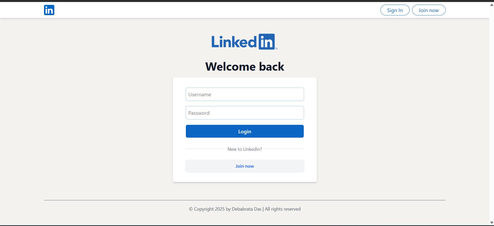
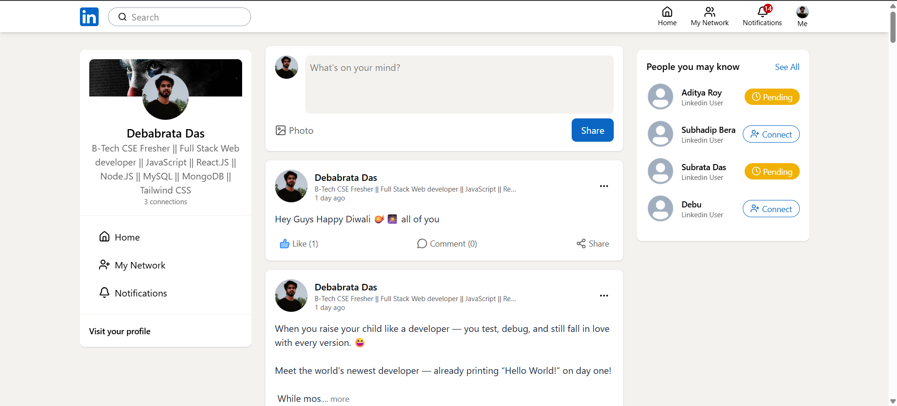
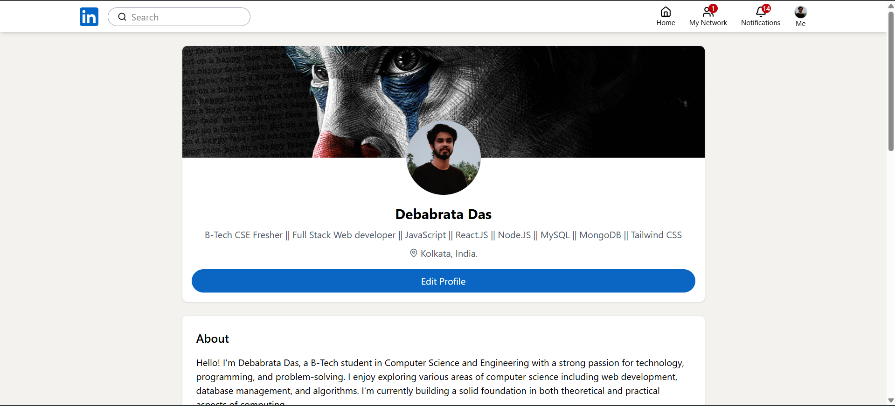
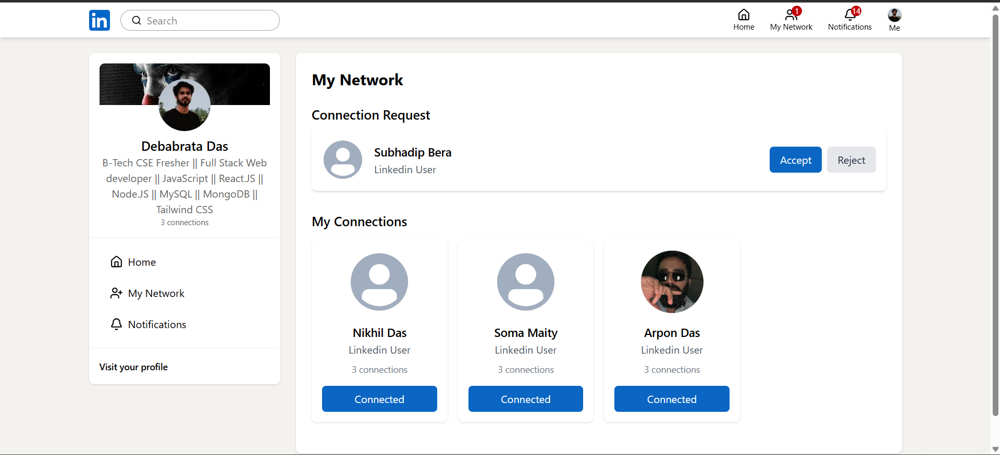
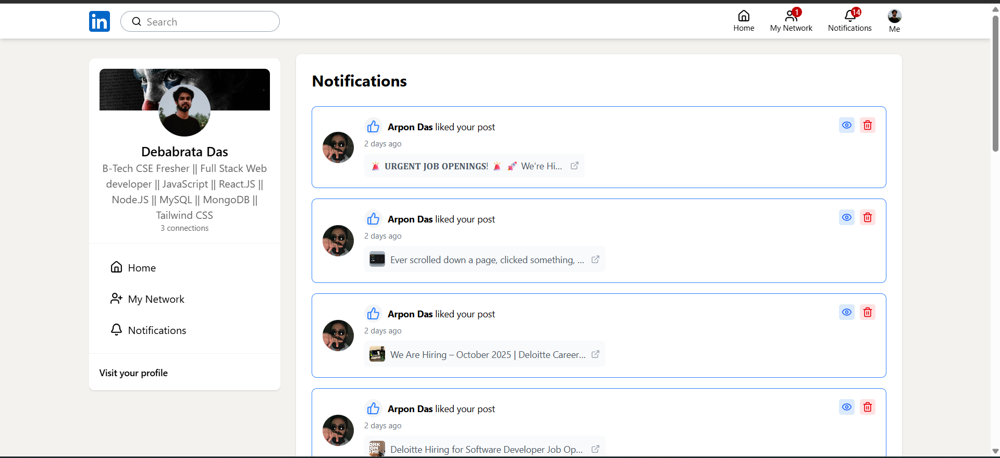
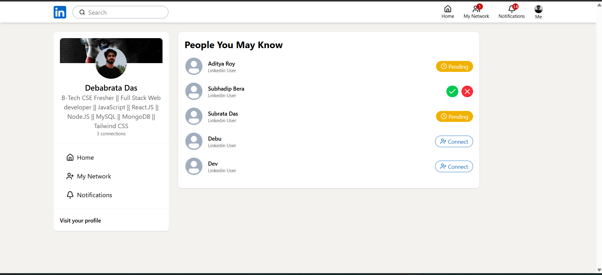
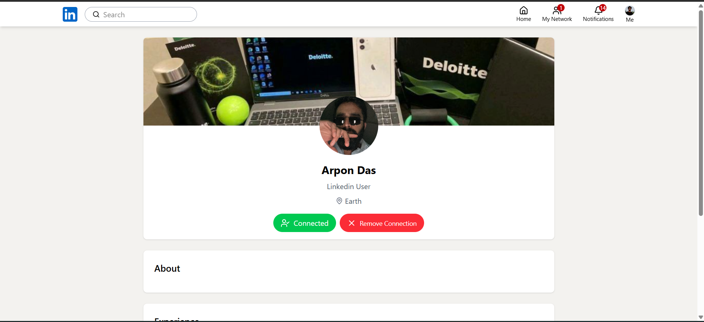

# LinkedIn Clone MERN

A simplified LinkedIn-like social network built with the **MERN** stack (MongoDB, Express, React, Node). This repository contains a full-stack example demonstrating common features found in professional social networks: user authentication, profiles, posts with media, likes/comments, connections, and notifications.

> ⚠️ This project is intended for learning and demo purposes only. It is **not** production hardened — do not use it to store real user data without adding security, validation, and compliance checks.

---

<!-- ## Table of Contents

- [Live demo](#live-demo)
- [Features](#features)
- [Tech stack](#tech-stack)
- [Repository structure](#repository-structure)
- [Requirements](#requirements)
- [Installation](#installation)
- [Environment variables](#environment-variables)
- [Run (development)](#run-development)
- [Build & deploy](#build--deploy)
- [API endpoints (overview)](#api-endpoints-overview)
- [Database models (overview)](#database-models-overview)
- [Testing](#testing)
- [Best practices & TODOs](#best-practices--todos)
- [Contributing](#contributing)
- [License](#license)

--- -->

<!-- ## Live demo

_None provided by default._ If you deploy this project to a service (e.g., Render, Vercel, Heroku, or Railway), add the link here.

--- -->

## 📸 Screenshots

### Login Page



### Home Page



### Profile Page



### My Network Page



### Notification Page



### Suggestions Page



### Suggestion Profile Page



---

## Features

- User signup / login with JWT-based authentication
- Profile creation and editing (headline, bio, experience, education)
- Create, edit, delete posts (text + image upload support)
- Like and comment on posts
- Follow / connect system (follow, accept requests, recommendations)
- Simple notifications feed
- Search users and posts
- Responsive React UI

---

## Tech stack

- Frontend: React (Create React App or Vite) + React Router + Redux + Tailwind CSS
- Backend: Node.js + Express
- Database: MongoDB (Mongoose ODM)
- Authentication: JWT (JSON Web Tokens)
- File storage: local uploads for dev or S3-compatible for production
- Dev tooling: ESLint, Prettier, concurrently (optional)

---

## Repository structure

```
/ (root)
├─ backend/
│  ├─ controllers/
│  ├─ models/
│  ├─ routes/
│  └─ utils/
├─ .env.example
├─ README.md
└─ package.json
├─ frontend/
│  ├─ public/
│  └─ src/
│     ├─ components/
│     ├─ pages/
│     ├─ hooks/
│     └─ services/
├─ README.md
└─ package.json
```

---

## API endpoints (overview)

This section lists the most important endpoints. Adjust according to actual implementation.

```
POST   /api/auth/register    # Register new user
POST   /api/auth/login       # Login, returns JWT
GET    /api/auth/me          # Get current user (protected)

GET    /api/users/:id        # Get user profile
PUT    /api/users/:id        # Update profile (protected)

POST   /api/posts            # Create post (protected)
GET    /api/posts            # Get posts (feed)
GET    /api/posts/:id        # Get single post
PUT    /api/posts/:id        # Edit post (protected)
DELETE /api/posts/:id        # Delete post (protected)
POST   /api/posts/:id/like   # Like / unlike post (protected)
POST   /api/posts/:id/comment# Add comment (protected)

POST   /api/connections/:id  # Send connection/follow request
POST   /api/connections/:id/accept
GET    /api/notifications
```

---

## Database models (overview)

Example Mongoose models you might have:

- **User**: _name, email, passwordHash, headline, location, about, experience\[], education\[], skills\[], avatarUrl, connections\[]_
- **Post**: _author (User ref), text, mediaUrl, likes \[User refs], comments \[{ author, text, createdAt }], createdAt_
  **ConnectionRequests**: _sender (User ref), receiver (User ref), status \[pending|accepted|rejected], createdAt, updatedAt_
- **Notification**: _user (recipient), type, payload, read, createdAt_

---

## Authentication & Security notes

- Passwords should be hashed using `bcrypt` (never store plain text).
- Use HTTPS in production and set secure cookies if you switch to cookie-based auth.
- Validate and sanitize user input to prevent XSS/NoSQL injection.
- Limit file upload size and validate file types if accepting images.

---

## Testing

Add unit and integration tests with Jest and Supertest for the backend and React Testing Library for the frontend. Example commands:

```bash
# server
cd server
npm test

# client
cd client
npm test
```

---

## Contributing

Contributions are welcome! Please open issues for bugs or feature requests and submit PRs with clear descriptions. Follow the repository's code style and add tests for new features.
